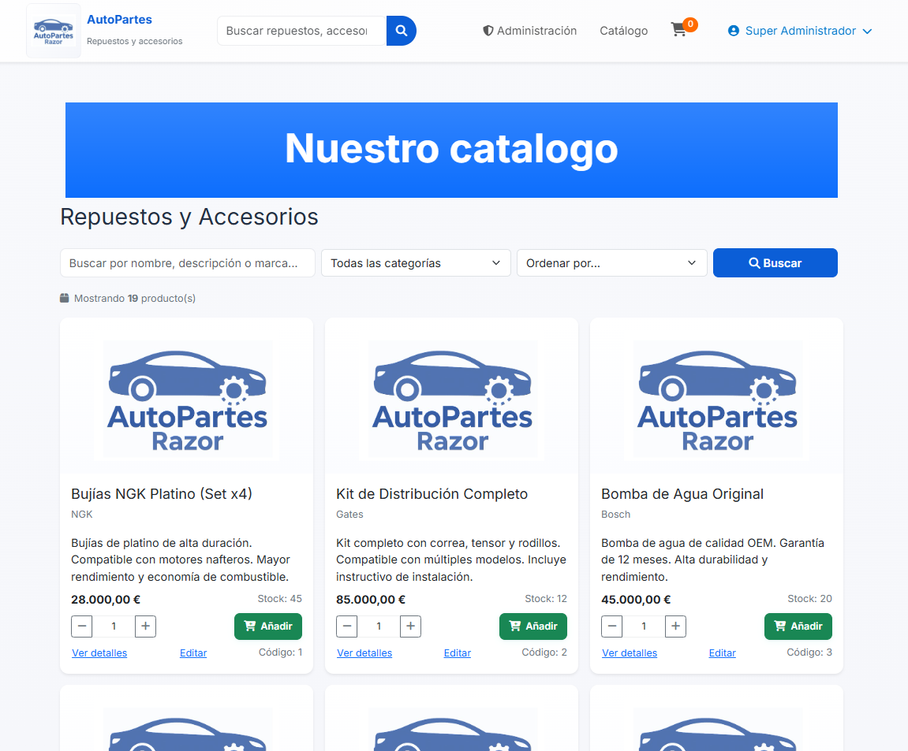
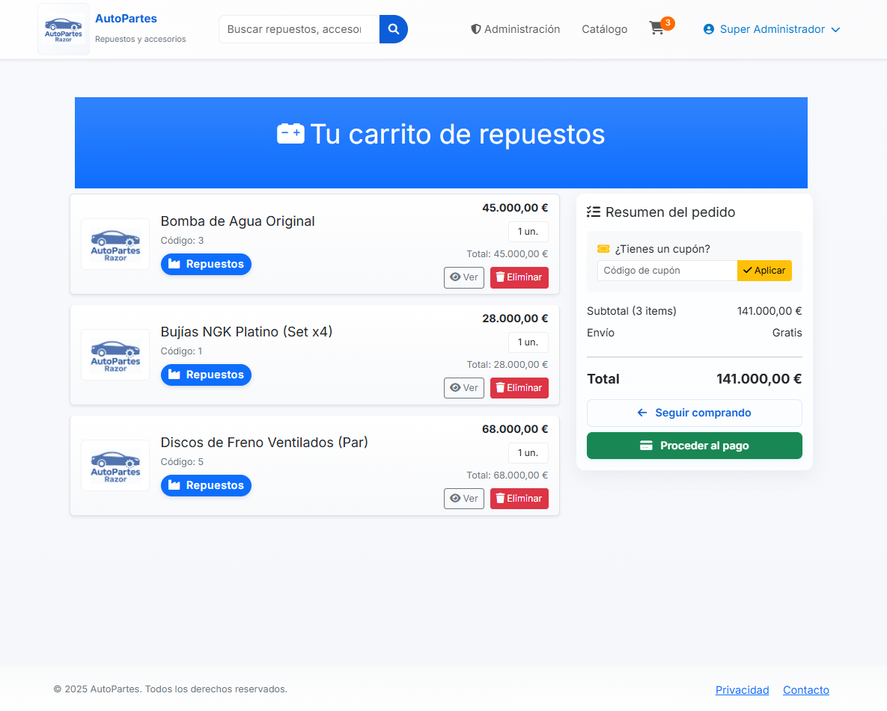
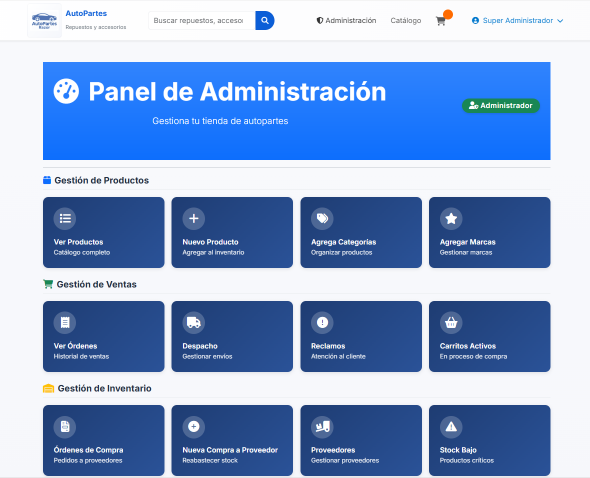
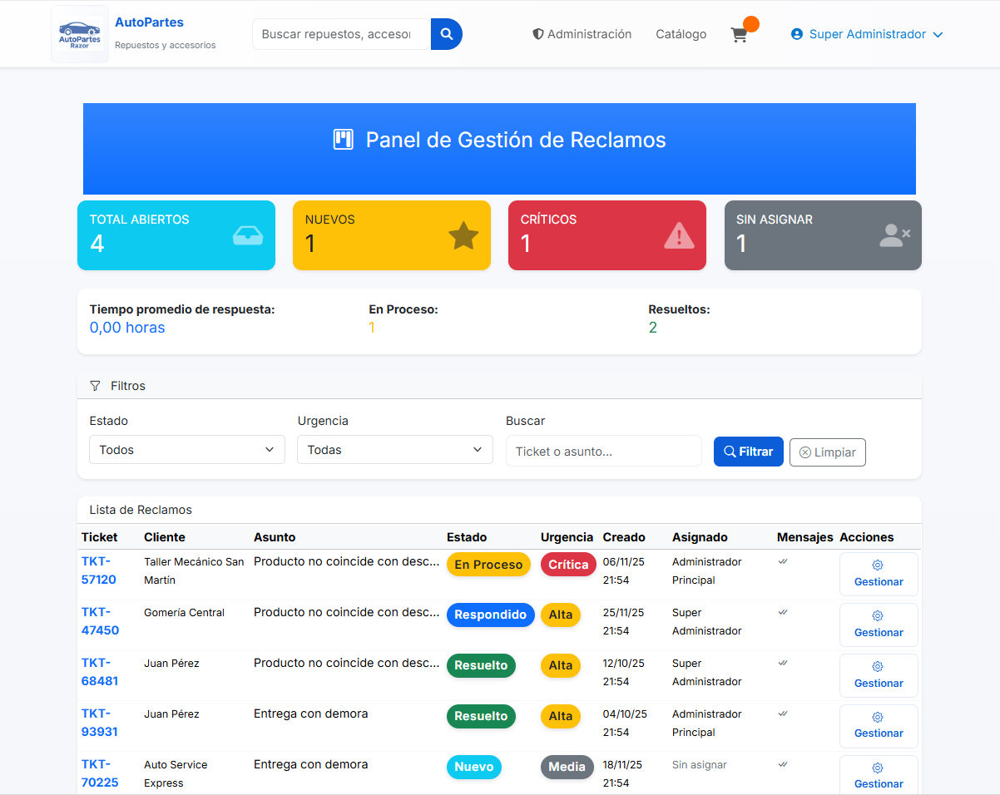

# 🚗 AutoPartes Razor - Sistema de Gestión de Repuestos Automotrices

[](https://dotnet.microsoft.com/)
[](https://docs.microsoft.com/en-us/aspnet/core/razor-pages/)
[](https://www.microsoft.com/en-us/sql-server)
[](https://getbootstrap.com/)
[](LICENSE)

Sistema completo de gestión para tiendas de repuestos automotrices desarrollado con ASP.NET Core Razor Pages. Incluye gestión de inventario, órdenes de compra y venta, sistema de reclamos, notificaciones, cupones de descuento y más.

---

## 📋 Tabla de Contenidos

- [Características](#-características)
- [Tecnologías](#️-tecnologías-utilizadas)
- [Requisitos Previos](#-requisitos-previos)
- [Instalación](#-instalación)
- [Configuración](#️-configuración)
- [Uso](#-uso)
- [Estructura del Proyecto](#-estructura-del-proyecto)
- [Roles y Permisos](#-roles-y-permisos)
- [Capturas de Pantalla](#-capturas-de-pantalla)
- [Contribuir](#-contribuir)
- [Licencia](#-licencia)
- [Contacto](#-contacto)

---

## ✨ Características

### 🔐 Gestión de Usuarios
- Sistema de autenticación con ASP.NET Identity
- 3 roles: **Administrador**, **Empleado**, **Cliente**
- Gestión completa de perfiles de usuario
- Sistema de permisos basado en Claims
- Recuperación de contraseña por email

### 📦 Gestión de Productos
- CRUD completo de productos
- Categorías y marcas
- Gestión de stock con alertas automáticas
- Múltiples proveedores por producto
- Imágenes de productos
- Historial de movimientos de stock
- Sistema de reseñas y calificaciones (1-5 estrellas)

### 🛒 Sistema de Ventas
- Carrito de compras funcional
- Proceso de checkout completo
- Múltiples métodos de pago
- Sistema de órdenes con estados:
  - Pendiente
  - Preparando
  - Despachado
  - En Camino
  - Entregado
  - Cancelado
- Filtros avanzados de búsqueda
- Historial de compras

### 🏭 Gestión de Proveedores
- CRUD de proveedores
- Órdenes de compra a proveedores
- Relación múltiple producto-proveedor
- Precios de compra diferenciados
- Sistema de reclamos a proveedores

### 📊 Inventario y Stock
- Control de stock en tiempo real
- Stock mínimo y alertas automáticas
- Movimientos de stock:
  - Entrada por compra
  - Salida por venta
  - Ajustes (positivos/negativos)
  - Devoluciones
- Ajustes de stock con diferencias entre teórico y real
- Auditoría completa de movimientos

### 🎫 Sistema de Cupones
- Generación automática de cupones de descuento
- Cupones vinculados a reseñas negativas
- Fecha de expiración
- Control de uso único
- Aplicación automática en checkout

### 📝 Sistema de Reclamos
- Reclamos de clientes con tickets únicos
- Estados: Nuevo, En Proceso, Respondido, Resuelto, Cerrado
- Niveles de urgencia: Baja, Media, Alta, Crítica
- Sistema de mensajería bidireccional
- Asignación de administradores
- Notificaciones de mensajes no leídos

### 🔔 Notificaciones
- Sistema de notificaciones en tiempo real
- Notificaciones específicas por rol
- Alertas de stock bajo
- Confirmaciones de pedidos
- Ofertas y promociones

### 📄 Reportes y Documentos
- Generación de PDF para órdenes
- Facturas y comprobantes
- Reportes de inventario
- Historial de movimientos

### 🎨 Interfaz de Usuario
- Diseño responsive (Mobile-first)
- Bootstrap 5.3
- Font Awesome Icons
- Animate.css para animaciones
- SweetAlert2 para alertas elegantes
- Tema moderno y profesional

---

## 🛠️ Tecnologías Utilizadas

### Backend
- **ASP.NET Core 8.0** - Framework principal
- **Razor Pages** - Vista del servidor
- **Entity Framework Core** - ORM
- **ASP.NET Identity** - Autenticación y autorización
- **SQL Server** - Base de datos

### Frontend
- **HTML5 / CSS3**
- **Bootstrap 5.3** - Framework CSS
- **JavaScript (ES6+)**
- **Font Awesome 6** - Iconos
- **Animate.css** - Animaciones
- **SweetAlert2** - Alertas modales

### Herramientas
- **Visual Studio 2022** / **VS Code**
- **SQL Server Management Studio**
- **Git** - Control de versiones

---

## 📋 Requisitos Previos

Antes de instalar el proyecto, asegúrate de tener:

- [.NET 8.0 SDK](https://dotnet.microsoft.com/download/dotnet/8.0) o superior
- [SQL Server 2019](https://www.microsoft.com/en-us/sql-server/sql-server-downloads) o superior (Express es suficiente)
- [Visual Studio 2022](https://visualstudio.microsoft.com/) (recomendado) o VS Code
- [Git](https://git-scm.com/)

---

## 🚀 Instalación

### 1. Clonar el repositorio

```bash
git clone https://github.com/tu-usuario/autopartes-razor.git
cd autopartes-razor
```

### 2. Restaurar paquetes NuGet

```bash
dotnet restore
```

### 3. Configurar la base de datos

Edita el archivo `appsettings.json` y configura tu cadena de conexión:

```json
{
  "ConnectionStrings": {
    "AutoPartesRazorContext": "Server=(localdb)\\mssqllocaldb;Database=AutoPartesDB;Trusted_Connection=True;MultipleActiveResultSets=true"
  }
}
```

### 4. Aplicar migraciones

```bash
dotnet ef database update
```

### 5. Ejecutar el proyecto

```bash
dotnet run
```

La aplicación estará disponible en: `https://localhost:7000`

---

## ⚙️ Configuración

### Variables de Entorno

Puedes configurar las siguientes variables en `appsettings.json`:

```json
{
  "ConnectionStrings": {
    "AutoPartesRazorContext": "tu-cadena-de-conexion"
  },
  "EmailSettings": {
    "SmtpServer": "smtp.gmail.com",
    "SmtpPort": 587,
    "SenderEmail": "tu-email@gmail.com",
    "SenderPassword": "tu-contraseña",
    "SenderName": "AutoPartes"
  }
}
```

### Configuración de Identity

En `Program.cs` puedes ajustar las políticas de contraseñas:

```csharp
builder.Services.AddIdentity<User, IdentityRole>(options =>
{
    options.Password.RequireDigit = true;
    options.Password.RequiredLength = 8;
    options.Password.RequireNonAlphanumeric = false;
    options.Password.RequireUppercase = true;
    options.Password.RequireLowercase = true;
}).AddEntityFrameworkStores<AutoPartesRazorContext>()
  .AddDefaultTokenProviders();
```

---

## 💻 Uso

### Credenciales por Defecto

El sistema incluye datos de prueba precargados:

#### 👨‍💼 Super Administrador
- **Email:** `superadmin@autopartes.com`
- **Password:** `SuperAdmin123!`

#### 👨‍💼 Administrador
- **Email:** `admin@autopartes.com`
- **Password:** `Admin123!`

#### 👔 Empleados
- **Email:** `vendedor@autopartes.com`
- **Email:** `deposito@autopartes.com`
- **Email:** `atencion@autopartes.com`
- **Password:** `Empleado123!`

#### 👥 Clientes
- **Email:** `juan.perez@email.com`
- **Email:** `maria.rodriguez@email.com`
- **Email:** `carlos.gomez@email.com`
- **Password:** `Cliente123!`

### Flujo de Trabajo Típico

#### Para Administradores:
1. Login con credenciales de admin
2. Gestionar productos, categorías y marcas
3. Gestionar proveedores
4. Crear órdenes de compra
5. Revisar y procesar órdenes de venta
6. Atender reclamos de clientes
7. Generar reportes

#### Para Empleados:
1. Login con credenciales de empleado
2. Procesar órdenes pendientes
3. Actualizar estados de envío
4. Gestionar stock y inventario
5. Atender consultas de clientes

#### Para Clientes:
1. Registrarse o hacer login
2. Navegar catálogo de productos
3. Agregar productos al carrito
4. Realizar compra
5. Ver historial de pedidos
6. Crear reclamos si es necesario
7. Dejar reseñas de productos

---

## 📁 Estructura del Proyecto

```
AutoPartesRazor/
│
├── Constants/              # Constantes y permisos
├── Data/                   # Contexto de base de datos y seeders
│   ├── AutoPartesRazorContext.cs
│   └── DatabaseSeeder.cs
│
├── Interfaces/             # Interfaces de servicios
│   ├── IEmailSender.cs
│   ├── IPdfService.cs
│   ├── IUserService.cs
│   └── IClaimService.cs
│
├── Models/                 # Modelos de datos
│   ├── User.cs
│   ├── Product.cs
│   ├── Order.cs
│   ├── Claim.cs
│   ├── Coupon.cs
│   └── ...
│
├── Pages/                  # Razor Pages
│   ├── Account/           # Login, registro, perfil
│   ├── Administration/    # Panel de administración
│   ├── Products/          # CRUD de productos
│   ├── Orders/            # Gestión de órdenes
│   ├── Cart/              # Carrito de compras
│   └── Claims/            # Sistema de reclamos
│
├── Services/              # Servicios de negocio
│   ├── EmailSender.cs
│   ├── PdfService.cs
│   ├── UserService.cs
│   └── ClaimService.cs
│
├── wwwroot/               # Archivos estáticos
│   ├── css/              # Estilos personalizados
│   ├── js/               # Scripts JavaScript
│   ├── img/              # Imágenes
│   └── lib/              # Librerías de terceros
│
├── appsettings.json       # Configuración
└── Program.cs             # Punto de entrada
```

---

## 👥 Roles y Permisos

### Administrador
- ✅ Acceso total al sistema
- ✅ Gestión de usuarios
- ✅ Gestión de productos, categorías y marcas
- ✅ Gestión de proveedores y órdenes de compra
- ✅ Procesamiento de órdenes de venta
- ✅ Atención de reclamos
- ✅ Visualización de reportes y estadísticas
- ✅ Gestión de cupones
- ✅ Ajustes de inventario

### Empleado
- ✅ Visualización de productos
- ✅ Procesamiento de órdenes pendientes
- ✅ Actualización de estados de envío
- ✅ Gestión de stock
- ✅ Atención básica de reclamos
- ❌ No puede eliminar productos
- ❌ No puede gestionar usuarios

### Cliente
- ✅ Navegación del catálogo
- ✅ Compra de productos
- ✅ Gestión de carrito
- ✅ Visualización de historial de compras
- ✅ Creación de reclamos
- ✅ Dejar reseñas y calificaciones
- ✅ Gestión de perfil personal
- ✅ Uso de cupones de descuento
- ❌ No acceso al panel de administración

---

## 📸 Capturas de Pantalla

### Página Principal


### Catálogo de Productos


### Carrito de Compras


### Panel de Administración


### Sistema de Reclamos


---

### Guías de Contribución

- Sigue las convenciones de código existentes
- Escribe pruebas para nuevas funcionalidades
- Actualiza la documentación según sea necesario
- Asegúrate de que el código compile sin errores


## 📄 Licencia

Este proyecto está licenciado bajo la Licencia MIT. Ver el archivo [LICENSE](LICENSE) para más detalles.

---

## 📞 Contacto

**Desarrollador Principal:** AutoPartesRazor

- 📧 Email: sebastevez91@gmail.com
- 🐱 GitHub: [sebastevez91](https://github.com/sebastevez91)
- 💼 LinkedIn: [Sebastian Tevez](linkedin.com/in/sebastian-tevez-7b702322b)
- 🌐 Website: [miportafolio.com](https://sebastevez91.github.io/miportafolio/)

**Link del Proyecto:** [https://github.com/sebastevez91/ProjectPIII.git](https://github.com/sebastevez91/ProjectPIII.git)

## ⭐ Dale una estrella

Si este proyecto te resultó útil, considera darle una ⭐ en GitHub. ¡Gracias!

---

<div align="center">
  <p>© 2024 AutoPartes. Todos los derechos reservados.</p>
</div>